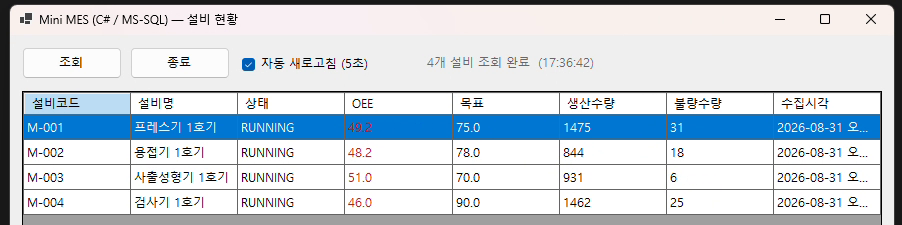
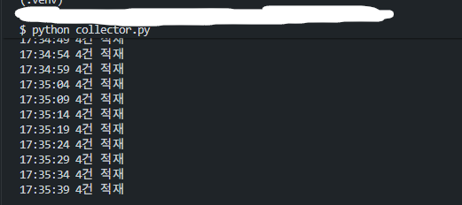

# Mini MES — C# / MS-SQL

> 설비 데이터 수집부터 현장 조회 화면까지, **3계층 구조**로 만든 소규모 생산관리 시스템

MES는 대개 세 덩어리로 나뉩니다. 설비에서 데이터를 **모으는 쪽**, 그것을 **저장하는 데이터베이스**, 현장 작업자가 보는 **단말 화면**입니다.
각 계층에 쓰이는 기술이 다르고, 하나만 알아서는 문제가 어디서 생겼는지 판단하기 어렵습니다.
이 프로젝트는 그 세 계층을 각각의 기술로 직접 구현하고 연결해 본 것입니다.

| | |
| -------- | ---------------------------------------- |
| **기간** | 2026.08 |
| **인원** | 1인 — 기획 · 설계 · 개발 전 과정 |
| **구성** | Python 수집기 → MS-SQL Server → C# WinForms 조회 화면 |

<br>



*설비 현황 화면. 자동 새로고침이 켜진 상태이며, 목표에 미달한 설비는 OEE 값만 붉게 표시된다.*

<br>



*수집기 실행 화면. 5초 간격으로 설비 4대의 측정값이 한 번에 적재된다.*

---

## 아키텍처

```
┌──────────────────────────────────────┐
│  Python 수집기  ·  collector.py       │
│  · 설비 4대 측정값 생성                │
│  · OEE 산출 = 가용성 × 성능 × 품질     │
└──────────────────┬───────────────────┘
                   │  5초마다 4건 배치 적재 (executemany)
                   ▼
╔══════════════════════════════════════╗
║  MS-SQL Server  ·  mini_mes          ║
║  · machine         설비 기준정보       ║
║  · production_log  생산 실적 누적      ║
╚══════════════════┬═══════════════════╝
                   │  설비별 최신 1건 조회
                   ▼
┌──────────────────────────────────────┐
│  C# WinForms  ·  Form1.cs            │
│  · 설비 현황 표 (DataGridView 바인딩)  │
│  · 5초 자동 새로고침                   │
│  · 목표 미달 설비 색상 강조             │
└──────────────────────────────────────┘
```

수집과 조회를 **데이터베이스를 사이에 두고 분리**했습니다.
수집기가 멈춰도 화면은 마지막으로 저장된 데이터를 계속 보여주고, 화면을 껐다 켜도 수집은 이어집니다.
실제 MES에서 현장 단말과 설비 인터페이스가 서로 독립적으로 동작해야 하는 이유와 같습니다.

| 계층 | 기술 |
| ---- | ---- |
| 수집 | Python 3, `pyodbc` (ODBC Driver 18 for SQL Server) |
| 저장 | Microsoft SQL Server 2025 Express |
| 화면 | C# (.NET 8), Windows Forms, `Microsoft.Data.SqlClient` |
| 도구 | Visual Studio 2022, sqlcmd |

---

## 데이터베이스 설계

설비의 **변하지 않는 정보**와 **계속 쌓이는 실적**을 두 테이블로 분리했습니다.
목표 OEE를 실적마다 중복 저장하지 않고 마스터에 두어, 목표가 바뀌어도 한 곳만 고치면 됩니다.

| `machine` — 설비 기준정보 | `production_log` — 생산 실적 |
| --- | --- |
| `machine_id` PK | `log_id` PK (IDENTITY) |
| `name` (NVARCHAR) | `machine_id` FK → machine |
| `type` | `logged_at` · `status` |
| `target_oee` | `availability` · `performance` · `quality` · `oee` |
| | `total_count` · `defect_count` |

- **FK 제약** — 등록되지 않은 설비 코드로 실적이 들어오는 것을 DB 차원에서 차단
- **복합 인덱스** `(machine_id, logged_at)` — 실적은 설비별·시간순으로 조회되므로 두 컬럼을 묶어 구성
- **OEE 컬럼 저장** — 조회할 때마다 세 지표를 곱하지 않도록 적재 시점에 계산해 저장
- **NVARCHAR + N 접두어** — 한글 설비명을 담기 위해 유니코드 타입을 쓰고 리터럴에 `N'...'` 표기

---

## 구현하면서 판단한 것들

기능을 붙이는 것보다, **왜 그렇게 만들었는지**가 남는 부분이라 생각해 정리했습니다.

### 1. 불량 수량을 난수가 아니라 품질률에서 유도

불량 수량을 따로 뽑으면 품질률이 99%인데 불량이 30%로 찍히는 모순이 생깁니다.

```python
quality      = round(random.uniform(0.960, 0.999), 4)
total_count  = random.randint(500, 1600)
defect_count = round(total_count * (1 - quality))   # 품질률에서 유도
```

지표 사이의 관계를 지키지 않은 데이터는 화면에 띄우는 순간 신뢰를 잃는다고 판단했습니다.

### 2. 설비 상태에 따라 가용성 범위를 분리

가용성은 실가동시간의 비율이므로, 정지(DOWN) 상태인데 95%가 나오면 안 됩니다.

```python
status = random.choices(["RUNNING", "IDLE", "DOWN"], weights=[85, 10, 5])[0]

if status == "RUNNING":
    availability = round(random.uniform(0.80, 0.97), 4)
else:
    availability = round(random.uniform(0.40, 0.70), 4)
```

상태 분포에도 가중치를 주어 실제 가동률에 가깝게 맞췄습니다.

### 3. Windows 인증과 SQL 인증을 모두 지원

MS-SQL은 로컬 설치 시 Windows 인증이 기본인 경우가 많고, 서버 환경에서는 SQL 인증을 쓰는 경우가 많습니다.
설정 파일에서 고를 수 있게 하고, SQL 인증인데 계정 정보가 없으면 **무엇이 빠졌는지 이름을 찍어** 알립니다.

```python
if db.getboolean("trusted_connection", fallback=True):
    parts.append("Trusted_Connection=yes")
else:
    missing = [k for k in ("user", "password") if k not in db]
    if missing:
        raise SystemExit(
            f"trusted_connection = no 이면 다음 항목이 필요합니다: {', '.join(missing)}")
    parts.append(f"UID={db['user']}")
    parts.append(f"PWD={db['password']}")
```

접속이 안 될 때 "Login failed"만 보고 원인을 찾는 것보다, **설정 단계에서 걸러내는 편이 빠르다**고 봤습니다.

### 4. 설비 4건을 한 번의 왕복으로 적재

설비마다 INSERT를 따로 실행하면 5초마다 네 번의 왕복이 발생합니다.
한 주기에 나온 측정값을 리스트로 모아 `executemany` 로 보내고 커밋도 한 번만 수행합니다.
pyodbc는 `fast_executemany` 를 켜면 다건 전송을 더 효율적으로 처리합니다.

```python
cursor.fast_executemany = True
rows = [make_reading(m) for m in MACHINES]
cursor.executemany(INSERT_SQL, rows)
conn.commit()
```

### 5. ROUND만으로는 자릿수가 정리되지 않는다

MySQL에서 그대로 옮겨온 `ROUND(oee * 100, 1)` 이 화면에 `49.5000` 으로 표시됐습니다.
MS-SQL의 `ROUND` 는 **값만 반올림하고 자료형의 소수 자릿수는 그대로 둡니다.**
`oee` 가 `DECIMAL(5,4)` 이므로 결과도 소수 넷째 자리까지 유지된 것입니다.

```sql
CAST(ROUND(l.oee * 100, 1) AS DECIMAL(4,1)) AS [OEE]
```

`CAST` 로 자릿수를 명시해 해결했습니다.
같은 함수라도 제품에 따라 동작이 다르다는 것을, 화면에 찍힌 값을 보고 알게 된 부분입니다.

### 6. SQL에 값을 문자열로 붙이지 않는다

쿼리는 `?` 자리표시자로 고정하고 값은 별도로 넘깁니다.
SQL 인젝션을 막는 기본이자, 드라이버가 타입 변환을 처리해 주어 코드가 단순해집니다.

### 7. 조회 로직을 공통 함수로 추출

버튼 클릭과 타이머가 같은 일을 해야 하므로 `LoadData()` 하나를 두 이벤트가 함께 호출합니다.
이후 조회 조건을 바꿀 때 한 곳만 고치면 됩니다.

```csharp
btnLoad.Click  += (_, _) => LoadData();
refreshTimer.Tick += (_, _) => LoadData();
```

### 8. 조회에 실패하면 자동 새로고침을 스스로 끈다

DB 연결이 끊긴 상태로 자동 새로고침이 켜져 있으면 5초마다 같은 오류를 반복하며 사용자를 방해합니다.

```csharp
catch (Exception ex)
{
    lblStatus.Text = "조회 실패: " + ex.Message;
    chkAuto.Checked = false;   // 원인을 해결한 뒤 다시 켜도록
}
```

### 9. 경고는 행 전체가 아니라 해당 칸에만

처음에는 목표 미달 설비의 **행 전체**를 붉게 칠했습니다.
그런데 그러면 설비명·생산수량·수집시각까지 같이 물들어, 무엇이 문제인지가 흐려집니다.
문제가 있는 값은 OEE 하나이므로 그 칸만 표시하도록 바꿨습니다.

```csharp
DataGridViewCell cell = row.Cells["OEE"];
Color mark = oee < target ? Color.Firebrick : Color.Black;

cell.Style.ForeColor = mark;
// 행이 선택돼 파랗게 반전돼도 색이 보이도록 선택 상태 색도 지정한다.
cell.Style.SelectionForeColor = mark;
```

`SelectionForeColor` 를 함께 지정한 이유가 있습니다.
이것이 없으면 사용자가 그 행을 클릭하는 순간 선택 색이 글자색을 덮어써서 **정작 확인하려는 경고가 사라집니다.**

### 10. 표에 값을 직접 채우지 않고 데이터 바인딩 사용

조회 결과를 `DataTable` 에 담아 `DataGridView.DataSource` 에 연결했습니다.
셀을 하나씩 대입하는 코드가 사라지고, 조회 컬럼이 바뀌어도 화면 코드를 고칠 필요가 없습니다.

### 11. 접속 정보를 소스에서 분리

연결 문자열을 코드 상수로 두면 저장소에 그대로 노출됩니다.
`config.ini` 와 `appsettings.json` 으로 분리하고 예시 파일만 커밋했습니다.
설정 파일이 없으면 화면이 조회 버튼을 비활성화하고 **무엇을 해야 하는지 안내 문구를 띄웁니다.**

```csharp
if (!File.Exists(configPath))
{
    throw new FileNotFoundException(
        "appsettings.json 이 없습니다. appsettings.example.json 을 복사해 접속 정보를 입력하십시오.");
}
```

---

## 실행 방법

**1. 데이터베이스 생성** — SSMS 또는 sqlcmd로 `db/schema.sql` 실행

```powershell
cd db
sqlcmd -S localhost\SQLEXPRESS01 -No -E -i schema.sql -f 65001
```

> `-f 65001` 을 빼면 한글 설비명이 깨져서 들어갑니다.

**2. 수집기 실행**

```powershell
cd collector
copy config.ini.example config.ini    # 서버 주소와 인증 방식 입력
pip install -r requirements.txt
python collector.py
```

> `pyodbc` 는 **ODBC Driver for SQL Server** 가 설치되어 있어야 동작합니다.
> 설치된 드라이버는 `python -c "import pyodbc; print(pyodbc.drivers())"` 로 확인하고,
> `config.ini` 의 `driver` 값을 그 이름과 맞추십시오.

**3. 조회 화면 실행**

```powershell
cd MiniMesCs
copy appsettings.example.json appsettings.json    # 연결 문자열 입력
```

`MiniMesCs.csproj` 를 Visual Studio로 열고 **F5**.

> 접속 정보 파일(`config.ini`, `appsettings.json`)은 `.gitignore` 에 등록되어 저장소에 올라가지 않습니다.

---

## 한계와 다음 단계

**실제 설비와 연동한 것이 아닙니다.** 수집기가 만들어 내는 값은 시뮬레이션이며 PLC나 설비 통신은 포함되어 있지 않습니다.
이 프로젝트가 보여주는 것은 설비 연동 경험이 아니라, **수집 · 저장 · 조회 세 계층을 각각의 기술로 구현하고 연결해 본 경험**입니다.

이어서 만들 부분입니다.

- **기간 조회와 리포트 출력** — 날짜를 선택해 일자별 실적을 조회하고 CSV로 내보내기
- **OEE 계산의 저장 프로시저 이관** — 계산 로직을 DB 쪽으로 옮겨 화면·수집기가 같은 기준을 사용
- **실적 입력 화면** — 조회만 가능한 현재 구조에 현장 작업자의 입력 기능 추가

---

## 폴더 구조

```
csharp-mssql/
├─ collector/
│  ├─ collector.py           # 측정값 생성 · OEE 산출 · MS-SQL 적재 (pyodbc)
│  ├─ config.ini.example     # 접속 정보 템플릿
│  └─ requirements.txt
├─ db/
│  └─ schema.sql             # T-SQL 테이블 정의 + 설비 기준정보
└─ MiniMesCs/
   ├─ Form1.cs               # 조회 화면
   ├─ Program.cs             # 진입점
   ├─ MiniMesCs.csproj
   └─ appsettings.example.json
```
